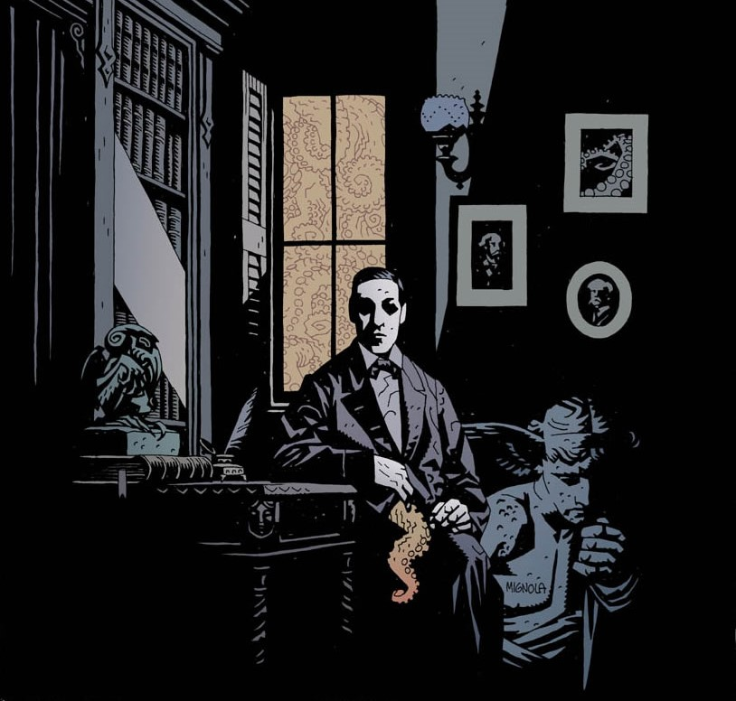
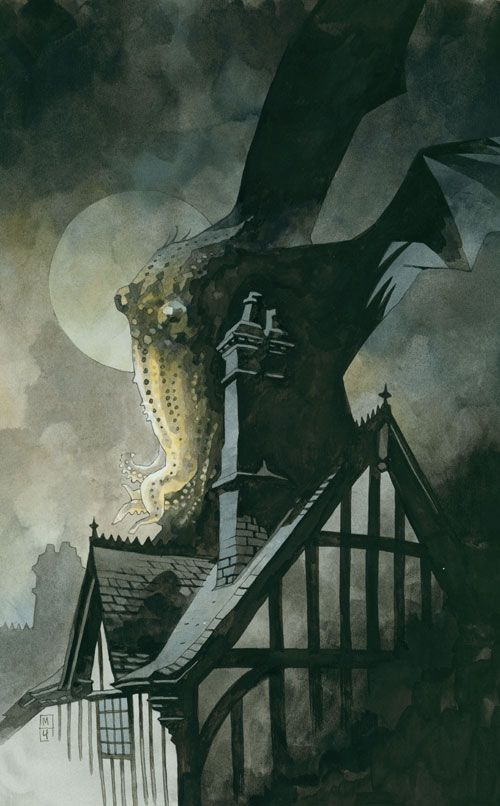

::: {style="text-align: center;"}
# H.P. Lovecraft
:::

::: {style="text-align: center;"}

:::

AUTHOR Jorge A. Rivera

::: justify
Howard Phillips Lovecraft (Providence, 20 de agosto de 1890-Providence, 15 de marzo de 1937), más conocido como H. P. Lovecraft, fue un escritor estadounidense, autor de relatos y novelas de terror y ciencia ficción. Se le considera un gran innovador del cuento de terror, al que aportó una mitología propia (los Mitos de Cthulhu), desarrollada en colaboración con otros autores, actualmente en vigencia.

Su obra constituye un clásico del horror cósmico, una línea narrativa que se aparta de las tradicionales historias de terror sobrenatural (satanismo, fantasmas), incluyendo elementos de ciencia ficción como, por ejemplo, razas alienígenas, viajes en el tiempo o existencia de otras dimensiones.
:::

## Biografía

Su familia provenía de una distinguida tradición burguesa venida a menos, razón que marcó, en buena medida, la personalidad elitista del autor de Providence. Su padre murió cuando este era aún muy pequeño y su madre lo sobreprotegió intentando que no se relacionara con gente que ella consideraba de clase inferior. En 1921, cuando el autor contaba con treinta y un años, la muerte de su madre le afectó profundamente. Luego, conoció a la escritora y comerciante Sonia Greene, con quien contrajo nupcias y se mudó a Nueva York, pero fracasó en su matrimonio. Tras sentir una profunda aversión por la vida neoyorquina —donde se acrecentó su racismo— Lovecraft decidió volver a su Providence natal donde vivió con sus tías hasta el fin de sus días.

De su estancia en Nueva York, Lovecraft continuó intercambiando correspondencia con autores como Robert E. Howard, Robert Bloch, Clark Ashton Smith o August Derleth, para quienes trabajó como escritor fantasma con algunos de ellos formando lo que se denominó, posteriormente, el Círculo de Lovecraft. Dichos autores colaboraron en buena medida en el desarrollo de su propia literatura y salvaron la obra de Lovecraft del olvido.

En sus últimos años, su naturaleza enfermiza y la desnutrición fueron minando su salud. Su anormal sensibilidad a cualquier temperatura inferior a los 20 °C se agudizó hasta el punto de que se sentía realmente enfermo a tales temperaturas. Durante el último año de su vida, sus cartas estaban llenas de alusiones a sus malestares y dolencias. A finales de febrero de 1937, cuando contaba con cuarenta y seis años, ingresó en el hospital Jane Brown Memorial, de Providence. Allí murió a primeras horas de la mañana del 15 de marzo de 1937 de cáncer intestinal complicado con la denominada enfermedad de Bright.

## Obra

El nombre de Lovecraft, actualmente, es uno de los más relevantes en cuanto a horror de ficción se refiere, pese a que este muriera siendo prácticamente un autor desconocido. Sus escritos, particularmente los Mitos de Cthulhu, han influido desde la década de 1960 a los autores de ficción a lo largo y ancho del mundo, y se pueden encontrar elementos propios de Lovecraft en novelas, películas, música, videojuegos, cómics y dibujos animados.

El estilo de Lovecraft es muy personal e inconfundible, caracterizado por un tono siempre serio y solemne. Era un maestro en el tono; usaba muchos adjetivos y palabras polisílabas y un tempo narrativo lento y detallado. También usaba cierto léxico para ir predisponiendo poco a poco la sensibilidad del lector a la atmósfera del relato —con palabras como «atávico», «numinoso», «arcano»...

Solía narrar sus relatos en primera persona y desde el punto de vista de un erudito usando un inglés arcaico que le servía para establecer firmemente un ambiente acorde a su idiosincrasia e, incluso, llegó a inventarse una bibliografía ficticia de grimorios en latín, árabe y hebreo —el Necronomicón de Abdul Alhazred, De Vermis Mysteriis, el Liber Ivonis aportación de su discípulo Robert Bloch, el Cultes de Goules del Conde D'Erlette, etcétera—.

Otra de las características propias del estilo lovecraftiano, tal cual señala el maestro del horror literario Stephen King, es que Lovecraft situaba sus historias de terror en situaciones cotidianas y las ambientaba en su misma época —la mayoría transcurrían en las décadas de 1920 y 1930—, donde lo espantoso eclosiona en la vida ordinaria de sus protagonistas, que salen de su cotidianidad para penetrar en lo desconocido. Las referencias que el autor hacía al pasado eran de una manera algo vintage.

Sus obras más representativas son: The Call of Cthulhu —La llamada de Cthulhu— (1926), At the Mountains of Madness —En las montañas de la locura— (1931) o The Case of Charles Dexter Ward —El caso de Charles Dexter Ward— (1941). :::

::: {style="text-align: center;"}

:::
